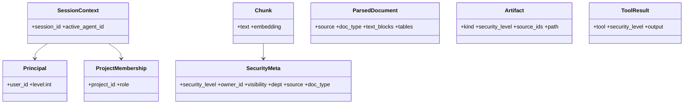

# D1. 클래스 설계서 — D.A.P

문서정보: 프로젝트 D.A.P · 단계 설계 · 코드 D1 · 근거 `backend/src/types.py`

## 1. 개요
권한 분리의 핵심 계약을 담는 도메인 클래스(불변 값 객체)와 모듈 서비스 클래스의 구조를 정의한다.
불변식: 보안 값 객체는 `frozen`, 보안 민감 호출은 `SessionContext`를 키워드-온리로 강제.

## 2. 핵심 도메인 클래스

## 3. 클래스 책임
- `Principal` 전역 신원/클리어런스(등급·부서). `ProjectMembership` (유저,프로젝트) 역할.
- `SessionContext` = Principal + Membership + active_agent_id. 모든 보안 호출의 입력 계약.
- `SecurityMeta` 청크에 박히는 보안/출처 메타(project_id/agent_id 없음 — 프로젝트 스코프는 project_data 연결). `Artifact`/`ToolResult` 등급 보유.
- `propagate_level(*levels)` 생성물 등급 = 소스 max.

## 4. 추적성
요구사항 R1(권한 분리)·R2(유스케이스) → 본 클래스. 구현 I1(`backend/src`).
