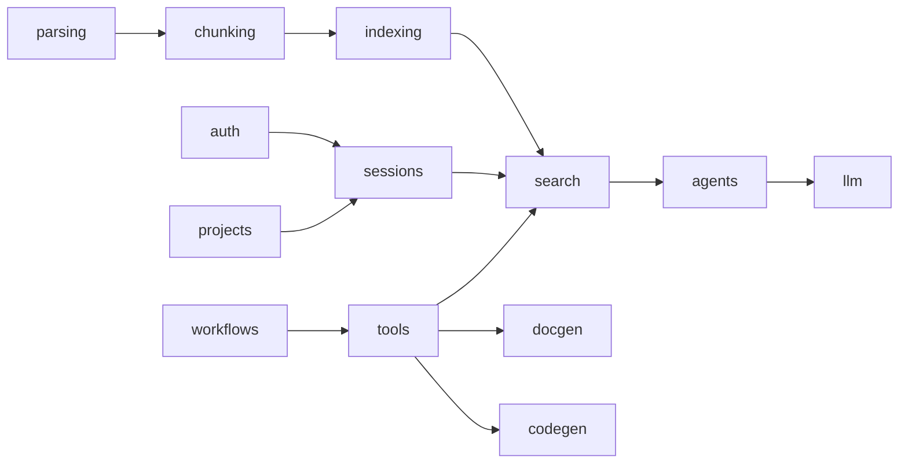

# D3. 컴포넌트 설계서 — D.A.P

문서정보: D.A.P · 설계 · D3 · 근거 `backend/src/*`

## 1. 개요
백엔드를 13개 컴포넌트로 분해. 모듈 경계를 넘는 결합은 `api/`에서만 조립.

## 2. 컴포넌트와 책임
| 컴포넌트 | 책임 | 페이즈 |
|---|---|---|
| parsing | 유형별 문서 → ParsedDocument | P1 |
| chunking | 청킹 + owner_id/visibility/등급/부서 태깅 (project_id 안 박음) | P2 |
| indexing | OpenSearch 색인(BM25+kNN, ML Commons) | P3 |
| search | 하이브리드 검색 + 3중 게이트 pre-filter | P4 |
| llm | vLLM(OpenAI 호환) 클라이언트, 등급 라우팅 | P5 |
| agents | LangGraph 멀티에이전트, available_agents | P5 |
| auth | SSO/LDAP → Principal | P6 |
| projects | 프로젝트·멤버십·RBAC | P12 |
| sessions | 유저별 세션·에이전트 선택 | P12 |
| tools | 도구 레지스트리(권한 스코프) | P9 |
| workflows | plan→act→observe 루프 | P9 |
| docgen | 문서 생성(등급 전파·출처) | P10 |
| codegen | 코드 생성 + 샌드박스 실행 | P11 |
| api | FastAPI 조립(챗 스트리밍·어드민) | 전 페이즈 |

## 3. 의존

## 4. 추적성
R2 → 컴포넌트. 인터페이스 상세 D4.
