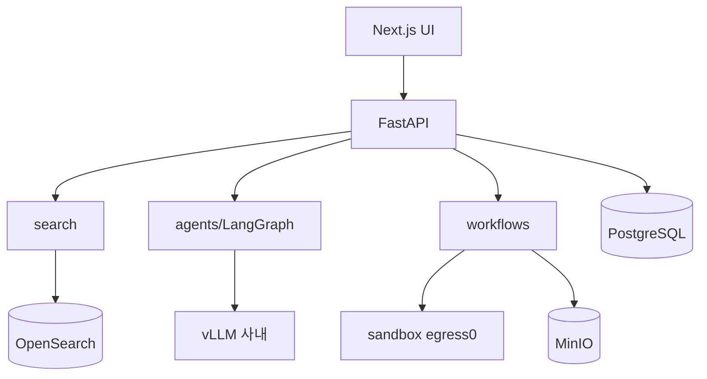

# D5. 아키텍처 설계서 — D.A.P

문서정보: D.A.P · 설계 · D5 · 근거 `docs/architecture.md`

## 1. 개요
온프레미스·망분리 전제의 권한분리형 멀티에이전트 RAG + 에이전틱 생성 플랫폼.

## 2. 아키텍처 결정(ADR 요약)
1. 단일 검색엔진 OpenSearch(BM25+kNN, ML Commons) — 별도 벡터DB 없음
2. 핵심 파싱 직접 제어(LangChain은 접착제)
3. 하이브리드 배치(Airflow DAG + 자체 트리거)
4. LangGraph 오케스트레이션
5. 권한 = 인덱싱 메타 + 쿼리 pre-filter(3중 게이트)
6. 로컬 LLM 서빙(vLLM, 외부 클라우드 금지, 등급 라우팅)
7. 생성물 등급 전파 + 코드 샌드박스 격리

## 3. 토폴로지

## 4. 배포/보안
망분리(외부 egress 차단), 데이터 저장 분담(정형=Postgres, 청크/임베딩=OpenSearch, 파일=MinIO).

## 5. 추적성
R1·R2 → 아키텍처. 상세 ADR `docs/architecture.md`.
