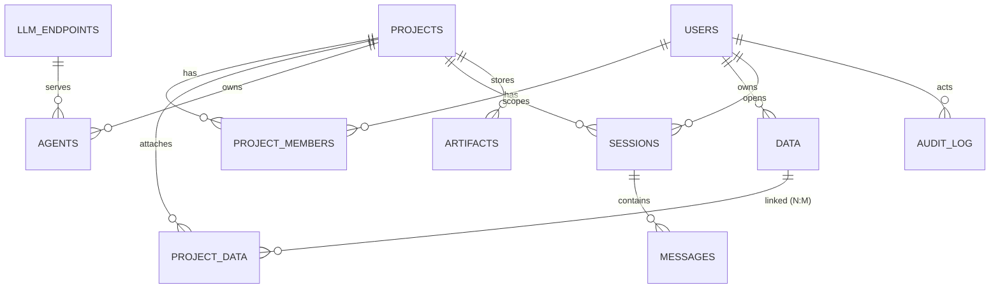

# D8. 엔티티 관계 모형 기술서 — D.A.P

문서정보: D.A.P · 설계 · D8 · 근거 `docs/data-model.md`

## 1. 개요
정형 메타데이터(Postgres)의 엔티티 관계. 프로젝트가 1급 격리 단위.

## 2. ERD

## 3. 엔티티 요지
- USERS(level, dept) · PROJECTS · PROJECT_MEMBERS(role)
- DATA(id PK=조인키, owner_id, source=원본경로, doc_type, security_level, visibility, dept) — 프로젝트 독립 라이브러리. 청크 meta.source == data.id
- PROJECT_DATA(project_id, data_id) — 라이브러리↔프로젝트 N:M 연결(검색 격리 게이트 ①의 근거). 청크엔 project_id 없음
- AGENTS(project_id, security_level=모델등급 자동, model_endpoint_id)
- SESSIONS(active_agent_id) · MESSAGES(source_ids)
- ARTIFACTS(project_id, security_level, source_ids) · AUDIT_LOG

## 4. 추적성
D9 물리 스키마로 구체화.
